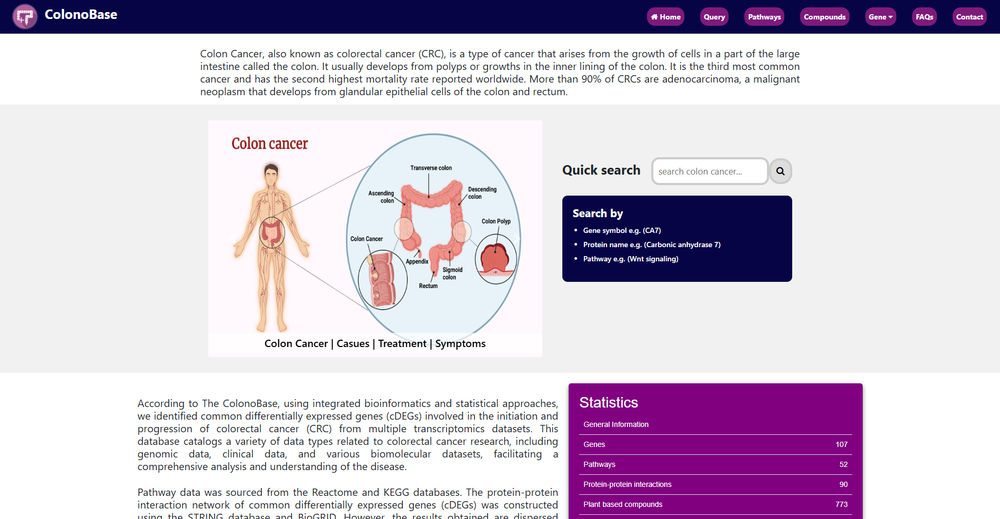
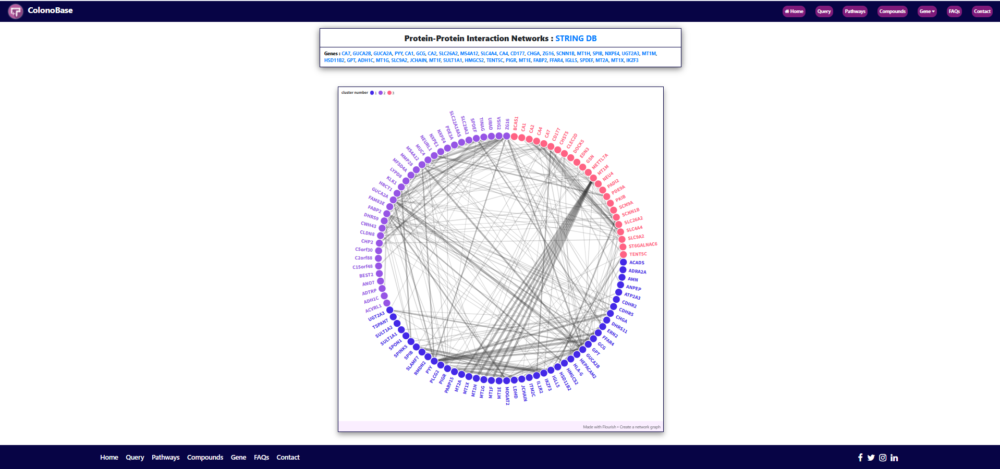

# 🌐 CBase — ColonoBase: Colon Cancer Database

---

## 📌 Overview

**ColonoBase (CBase)** is an integrated database for colorectal cancer (CRC) research that compiles common differentially expressed genes (cDEGs) identified from multiple transcriptomic datasets using bioinformatics and statistical approaches.

It integrates genomic, clinical, and biomolecular data to enable comprehensive analysis of CRC initiation and progression. The database also includes **plant-based bioactive compounds** along with their **chemical and physicochemical properties**, supporting drug discovery and therapeutic research.

Pathway data is sourced from Reactome and KEGG, while protein–protein interaction networks are constructed using STRING and BioGRID. By consolidating fragmented data from diverse studies into a unified platform, ColonoBase facilitates advanced research in colorectal cancer.

---

## 🎯 Key Features

- 🧬 Curated **Colon Cancer Biomarker Dataset**
- 🔗 Integrated **protein-protein interaction networks**
- 🧪 Detailed **plant-based bioactive compounds** and their **chemical and physicochemical properties**
- 🌐 User-friendly web interface

---

## 🗂️ Database Contents

| Module | Description |
|--------|------------|
| 🧬 Gene Information | Colon cancer-associated genes |
| 📊 Expression Data | Gene activity (up/down regulation) |
| 🧫 Compound Details | Plant-based bioactive compounds with chemical and physicochemical properties | 🧬 Protein–Protein Interactions | Interaction networks derived from STRING and BioGRID |
| 🛤️ Pathways | Biological pathways from KEGG and Reactome |

---

## 🚀 Live Demo

  

---

## 🧠 Use Cases

- 🔬 Colon cancer biomarker discovery  
- 🧬 Network biology & systems biology  
- 💊 Drug target identification for colon cancer  
- 🔗 Multi-level molecular interaction analysis  

---

## 🛠️ Tech Stack

  

- 🌐 HTML, CSS, JavaScript  
- 📊 Structured biological datasets  
- 🧬 Bioinformatics & computational biology  

---

## 📷 Preview

  

  

---
